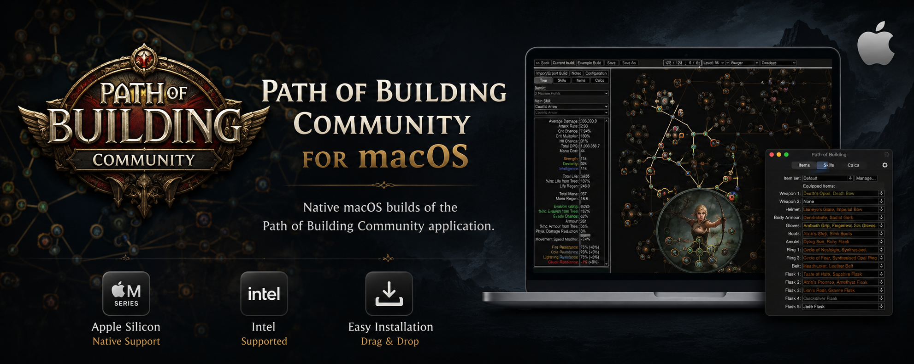
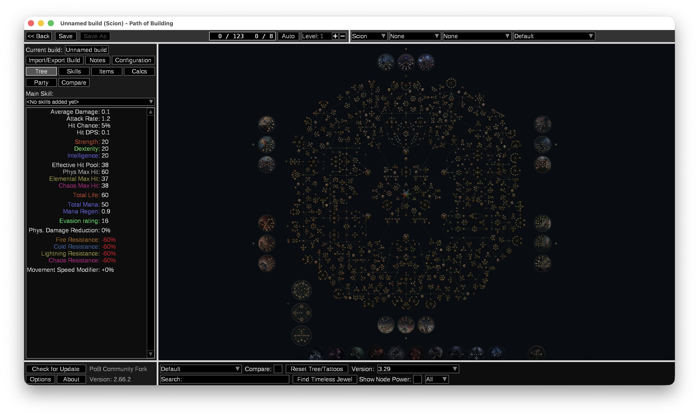
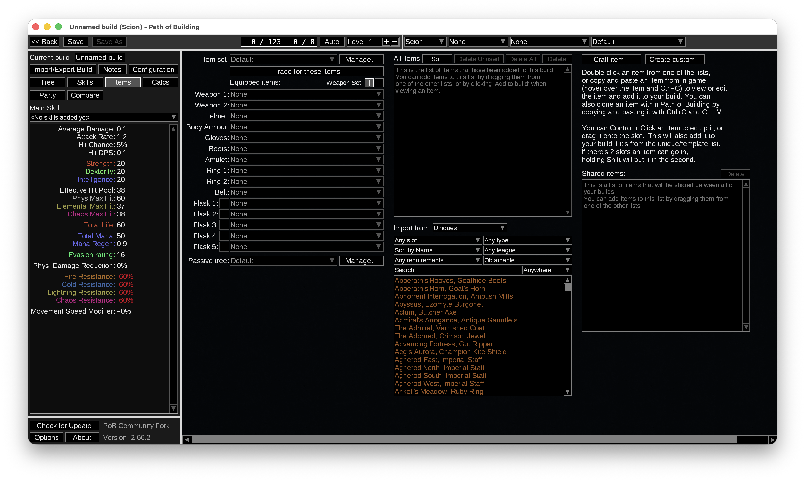
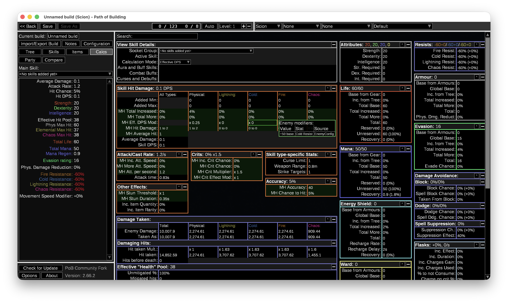

# Path of Building Community for macOS

A native macOS packaging project for the excellent Path of Building Community application.

This project provides pre-built macOS releases for both Apple Silicon and Intel Macs, allowing Path of Building Community to run as a standard macOS application without requiring Wine, CrossOver or other compatibility layers.

---

## Features

- Native macOS application (.app)
- Apple Silicon (M1, M2, M3 and newer) support
- Intel Mac support
- Simple drag-and-drop installation
- Built from the latest Path of Building Community source
- Open source
- Regularly updated alongside Community releases

---

## Download

Download the latest release from the **Releases** section of this repository.

After downloading:

1. Open the DMG.
2. Drag **Path of Building Community** into your Applications folder.
3. Launch the application.

On first launch, macOS may display a security warning.

If this happens:

- Right-click the application.
- Select **Open**.
- Confirm that you want to launch it.

This only needs to be done once.

---

## Why this project?

Path of Building is an essential tool for Path of Exile players, but running it on macOS has traditionally required additional compatibility software.

The goal of this project is simple:

Provide a native-feeling macOS application that installs and behaves like any other Mac application while remaining fully compatible with the Community Fork.

No gameplay features have been modified.

---

## Screenshots

### Passive Tree

### Items

### Calculations

---

## Keeping up to date

Each release is built from the latest available Path of Building Community source.

When a new Community version is released, a matching macOS release will be published here as soon as possible.

---

## Reporting Issues

If you encounter a problem, please include:

- macOS version
- Apple Silicon or Intel Mac
- Path of Building version
- Steps to reproduce the issue
- Crash logs (if available)

Please report issues using the GitHub Issues page.

---

## Credits

All credit for Path of Building itself belongs to the incredible Path of Building Community team.

This repository does **not** modify the application's gameplay calculations or functionality.

Its purpose is to package and distribute the Community project as a native macOS application for the benefit of Mac users.

Please support the original project:

https://github.com/PathOfBuildingCommunity/PathOfBuilding

---

## Licence

This repository follows the same licensing as the upstream Path of Building Community project where applicable.

See the LICENSE file for details.
